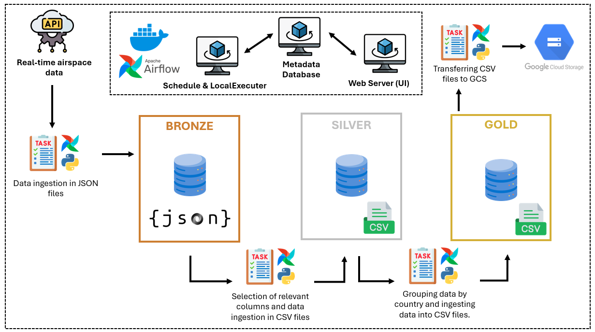
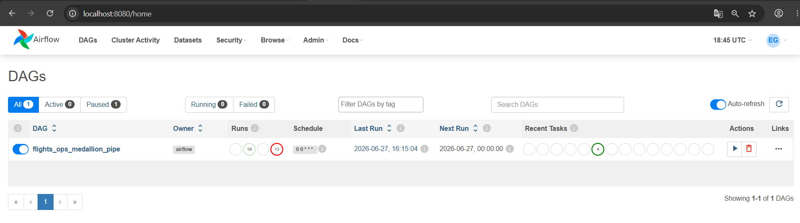
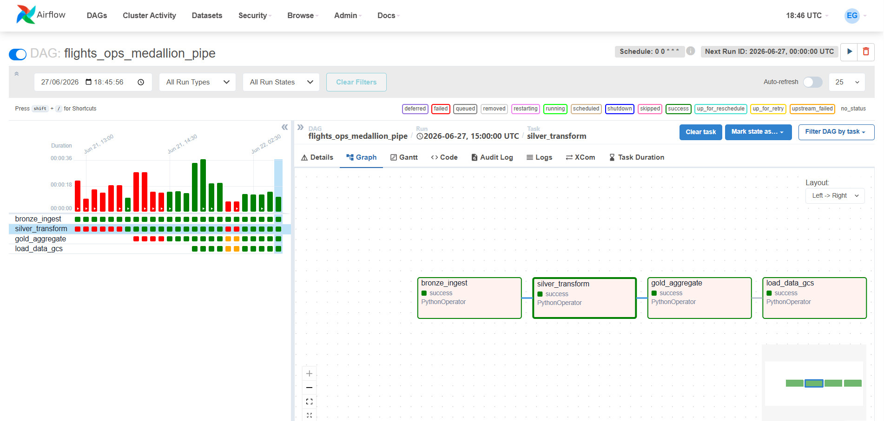
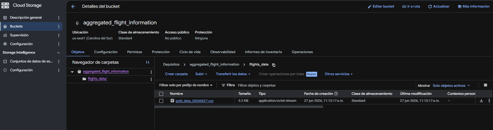
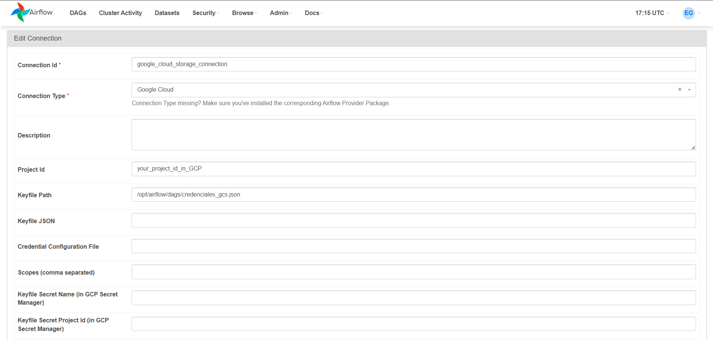

# ✈️ Airflow Flight Data Pipeline

Un proyecto de **Data Engineering end-to-end** que demuestra cómo construir un pipeline ETL estilo producción utilizando **Apache Airflow**, **Docker**, **Python** y **Google Cloud Storage (GCS)**.

El pipeline ingiere datos en tiempo real desde la **OpenSky Network API**, los procesa siguiendo la arquitectura **Medallion (Bronze → Silver → Gold)** y almacena el dataset final agregado en Google Cloud Storage para análisis posteriores.

---

# 🚀 Descripción del Proyecto

Las plataformas modernas de datos requieren pipelines automatizados y confiables capaces de ingerir, transformar y entregar datos de alta calidad.

Este proyecto simula un flujo ETL real mediante:

* Extracción de información de vuelos desde una API pública.
* Almacenamiento de datos crudos en la capa Bronze.
* Limpieza y transformación en la capa Silver.
* Agregación de métricas en la capa Gold.
* Carga del dataset final en Google Cloud Storage.
* Orquestación completa mediante Apache Airflow.

El proyecto sigue buenas prácticas de ingeniería de software separando la lógica de orquestación de la lógica de procesamiento de datos, lo que lo hace modular, mantenible y escalable.

---

# 🏗️ Arquitectura



Todo el pipeline es orquestado por **Apache Airflow**, donde cada etapa se ejecuta como una tarea independiente.

---

# ⚙️ Orquestación del Workflow

El flujo ETL es orquestado mediante **Apache Airflow**.

Cada etapa del procesamiento está implementada como un `PythonOperator` independiente, siguiendo el principio de **single responsibility**.

Configuración del DAG:

| Parámetro  | Valor                        |
| ---------- | ---------------------------- |
| DAG ID     | `flights_ops_medallion_pipe` |
| Schedule   | `0 0 * * *`                  |
| Frecuencia | Diario (00:00 UTC)           |
| Catchup    | False                        |
| Retries    | 0                            |

Dependencias del flujo:

```text id="q7k2mz"
bronze_ingest
        │
        ▼
silver_transform
        │
        ▼
gold_aggregate
        │
        ▼
load_data_gcs
```

Las tareas se comunican mediante **Airflow XComs**, permitiendo que cada etapa recupere dinámicamente los archivos generados por la anterior sin usar rutas hardcodeadas.





---

# 🥉 Capa Bronze

La capa Bronze se encarga de la **ingesta de datos**.

### Proceso

* Conexión a la OpenSky Network REST API.
* Obtención de los estados actuales de aeronaves.
* Almacenamiento del response completo en un archivo JSON con timestamp.
* Conservación del dato crudo sin transformaciones.

### Output

```text id="l2k9pm"
data/bronze/flights_YYYYMMDDHHMMSS.json
```

---

# 🥈 Capa Silver

La capa Silver realiza la **limpieza y transformación de datos**.

### Proceso

* Lectura del archivo JSON crudo.
* Conversión a DataFrame usando Pandas.
* Asignación de nombres de columnas significativas.
* Selección de atributos relevantes para análisis.
* Exportación a formato CSV limpio.

### Atributos seleccionados

* ICAO24
* Origin Country
* Velocity
* On Ground

### Output

```text id="m9p2xv"
data/silver/flights_silver_YYYYMMDD.csv
```

---

# 🥇 Capa Gold

La capa Gold genera datasets listos para análisis.

### Agregaciones

Por cada país de origen se calculan:

* Total de vuelos
* Velocidad promedio de aeronaves
* Número de aeronaves en tierra

### Output

```text id="z1k8qa"
data/gold/flights_gold_YYYYMMDD.csv
```

---

# ☁️ Google Cloud Storage

Después de generar la capa Gold, el archivo es subido automáticamente a Google Cloud Storage mediante el **Google Cloud Storage Hook** de Airflow.

Destino:

```text id="c8n2qp"
gs://aggregated_flight_information/flights_data/
```

Esto permite que los datos estén disponibles para dashboards, reporting o análisis downstream.



---

# 📁 Estructura del Proyecto

```text id="p3k8mn"
Airflow-Flight-Pipeline-Project
│
├── dags/
│   └── flight_pipeline.py   # DAG de Airflow
│
├── scripts/
│   ├── bronze_ingest.py
│   ├── silver_transform.py
│   ├── gold_aggregate.py
│   └── load_gold_to_gcs.py
│
├── data/
│   ├── bronze/
│   ├── silver/
│   └── gold/
│
├── docker-compose.yml
├── requirements.txt
├── .env.example
├── .gitignore
└── README.md
```

---

# 🛠️ Tecnologías Utilizadas

* Python
* Apache Airflow
* Docker
* Pandas
* Google Cloud Storage
* OpenSky Network REST API

---

# ▶️ Ejecución del Proyecto

## 1. Clonar el repositorio

```bash id="d1k8pq"
git clone https://github.com/JeanEdinson/Airflow-Flight-Pipeline-Project.git

cd Airflow-Flight-Pipeline-Project
```

---

## 2. Configurar el entorno

Crear un archivo `.env` basado en `.env.example`.

Agregar:

* Credenciales de PostgreSQL
* Credenciales de Airflow

Además, colocar el archivo de service account de Google Cloud en la ruta del proyecto para posteriormente configurar la conexión desde la UI de Airflow.


---

## 3. Levantar Airflow

```bash id="x8k2qp"
docker compose up -d
```

---

## 4. Abrir la interfaz de Airflow

```text id="v2k8mn"
http://localhost:8080
```

Activar el DAG y ejecutarlo manualmente.

---

# 🔄 Flujo del Pipeline

Cada ejecución realiza automáticamente:

1. Descarga datos en tiempo real desde OpenSky Network.
2. Almacena datos crudos en Bronze.
3. Transforma datos en Silver.
4. Agrega métricas en Gold.
5. Sube resultados a Google Cloud Storage.

---

# 💡 Conceptos de Ingeniería Demostrados

Este proyecto demuestra conceptos clave de Data Engineering:

* Desarrollo de ETL Pipelines
* Apache Airflow Workflow Orchestration
* PythonOperator
* Comunicación entre tareas con XCom
* Medallion Architecture
* Integración con REST APIs
* Transformación de datos con Pandas
* Integración con Cloud Storage
* Contenerización con Docker
* Diseño modular de proyectos
* Scheduling con cron expressions

---

# 🚀 Mejoras Futuras

Posibles mejoras del proyecto:

* Validación de calidad de datos con Great Expectations
* Tests unitarios e integración
* Ingesta incremental
* Logging y monitoring avanzado
* CI/CD con GitHub Actions
* Integración con BigQuery
* Infraestructura como código con Terraform
* Data lineage con OpenMetadata

---

# 📷 Capturas Recomendadas

Se recomienda agregar:

* Ejecución del DAG en Airflow
* Graph View del pipeline
* Logs de ejecución
* Bucket en Google Cloud Storage
* Diagrama de arquitectura

---

# 👨‍💻 Sobre mí

Apasionado por Data Engineering, pipelines de datos, cloud computing y automatización de procesos.

Este proyecto fue desarrollado como parte de mi aprendizaje en la construcción de pipelines escalables y automatizados usando herramientas modernas de Data Engineering.

---
